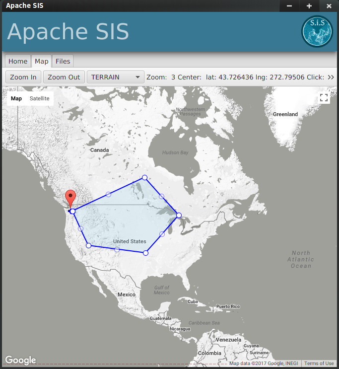
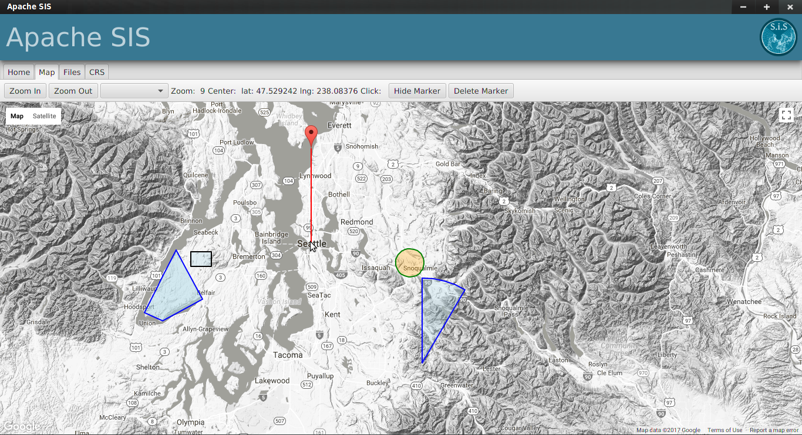
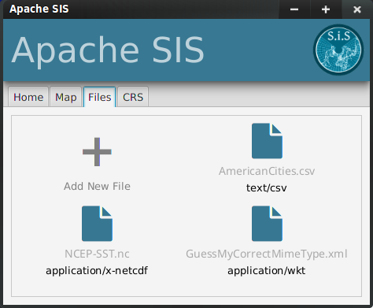

# Apache SIS GUI Client

## Overview
Apache SIS is a library for working with geospatial data, metadata and coordinate operations.
This app is meant to demonstrate the capabilities of the library and to make it convenient to use its most common functionality:

- Reading and editing metadata
- Reading CRS and applying transformations
- Display vector data in tabular format
- Visualize everything on a map

## Features

Ability to draw a polygon on the map 

As well as markers and different shapes

Drag and drop file functionality with correct mime type detection

**...and more coming up**

## Libraries Used

- JavaFX version 8u60
- [Apache SIS](http://sis.apache.org/) 
- [GMapsFX](http://rterp.github.io/GMapsFX/ ) by [Rob Terpilowski](https://github.com/rterp) 