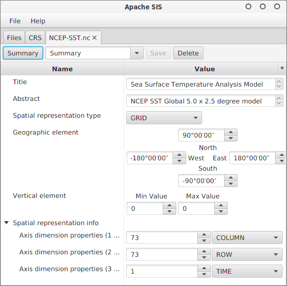

# Apache SIS GUI Client

## Overview
Apache SIS is a library for working with geospatial data, metadata and coordinate operations.
This app is meant to demonstrate the capabilities of the library and to make it convenient to use its most common functionality:

- Reading and editing metadata
- Reading CRS and applying transformations
- Display vector data in tabular format

## Requirements

- Java version 8u60
- Maven 3

You can open this project in NetBeans 8 and directly run it. Any other ide with maven support will do too.

## Google Summer of Code 2017

This project is a part of GSoC 2017 under the guidance of my mentor [Martin Desruisseaux](https://github.com/desruisseaux "Martin's Github profile" ). View the [project page](https://summerofcode.withgoogle.com/projects/#4851015240122368).
This repo is fixed purpose for this GSoC and is a work from scratch. All commits have been made by me.
 
###  State of the application

Starting point of the application  

In the menu `Help` > `About` shows the following about screen. Certain nodes like `Localization` and `Versions` are expanded by default.  

File listing pane. You can add files by either dragging them onto the application or opening them with file browser either through `File` > `Open` Menu or `Add New File` button.  
The mime type of the file is detected using Apache SIS `DataStore`. If it cant be detected then the file system mime detection fallback is used which is marked with `*`.  

In the file pane if you right click (context menu) on a file and click on `Open metadata` menu then a metadata view tab is opened in Summary mode by default.  
This shows some of the most important information that is required on a regular basis.  

Toggling the `Summary` button switches to the Tree Table view which shows all metadata in a hierarchical manner. Specialized table cells allow editing metadata.  

The configuration combo box at the top shows a list of view configurations for the metadata.
Configuration includes keeping certain nodes expanded/collapsed by default, not including certain nodes in the tree table, sort order for nodes. 
There is a `Default` configuration which shows all nodes expanded in their default order. To create new configurations you'll have to modify the tree table state by:

- expanding/collapsing nodes
- delete nodes by right click (context menu) > `Hide node`
- delete parent but keep children in the same position by right click (context menu) > `Flatten node`
- move nodes up or down by right click (context menu) > `Move up`or `Move down` or `shift`+`arrow up/down`

Once a configuration is modified the `Save` button becomes enabled and clicking it will save the updated current config.
Type your new configuration name in the combo box and hit enter to create a new configuration instead.
Similarly the `Delete` button deletes the currently active configuration. You cannot delete the default configuration.
Configurations are stored using Java Preferences API under the namespace `org/apache/sis/desktop`.
On Linux it is stored as folder structure with xml files under `${user.home}/.java/.userPrefs/org/apache/sis/desktop`.
On Windows it is stored in the Registry.

Configurations are meant for the end user to create different views for different use cases, by simply interacting with the UI, without any programming.
In the following screenshot I have created a *summary* config which is very similar to the Summary pane but with editing support.  

The CRS editor allows you to view an existing CRS, change it to something else by searching, and create custom crs by modifying any of the values in the editor.  

The crs list shows a list of all installed CRS definitions. You can then right click to view the CRS in the crs editor.  

### Summary of features implemented

- Simplified view of metadata to show only the most relevant and frequently used information.
- Custom widgets for metadata, some of which are reused in the CRS editor. 
- Configuration support for metadata to provide user editable views of the metadata.
- CRS editor with search support and asynchronous reloading.
- Feature viewer for GPX waypoints.

### Features not yet implemented 
 
- Currently there is no write back support in metadata editor. When a metadata element is edited using a custom cell, the cell should fire a `commitEdit` with the new value which will be updated in the metadata using `TreeTable.setValue` function. However this method throws `UnsupportedOperationException`.

- The Feature viewer currently displays only GPX waypoints data. It is not generic enough to deal with different kinds of data like csv, shapefile etc.
There is some work done for route and track display. Since most features are expected to be latitude/longitude based this work can be reused.

- The CRS editor doesn't generate new objects for modified data for non combo box elements. However this logic needs to be placed in only one event listener which has been marked with an appropriate comment in the code. 

- Coordinate Transformation is incomplete. This component will deal with csv files and crs definitions. The CRS editor, Feature viewer (`WaypointsController`) and Files pane will simplify the creation of this component. The logical part already exists in `sis-console` module.

### Challenges 

Apache SIS comes with excellent quality documentation. However software documentation is not a replacement for knowledge of the field.
Since I dont know much about geospatial systems it was not obvious to me in what way this software was going to be used.
Initially a lot of time was spent on the metadata editor and it took a while to understand the structure of ISO 19115 standard.
The dynamic nature of the library meant that specific type information would be available at runtime with example files. 
Code snippets provided by my mentor were very helpful and saved many hours of figuring out things from documentation.

